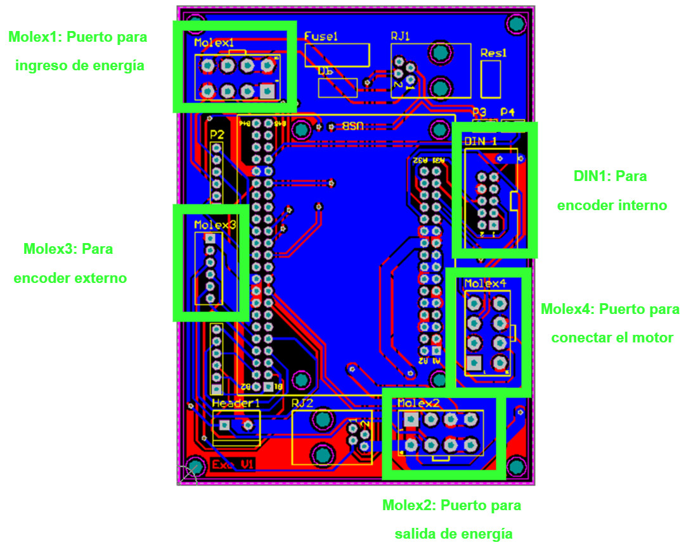
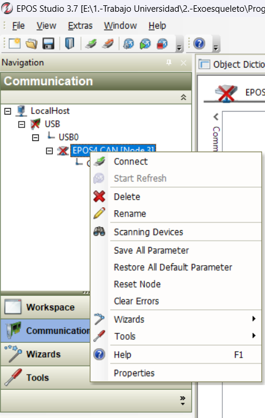
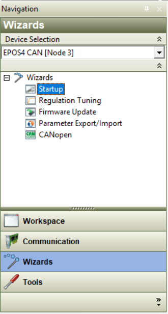
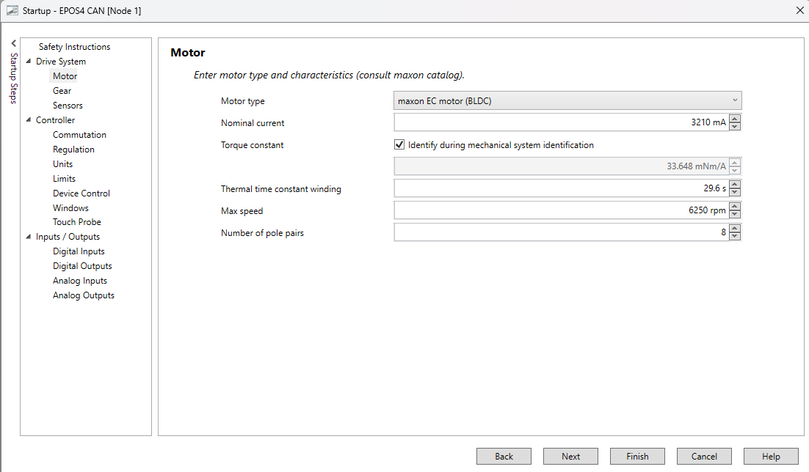
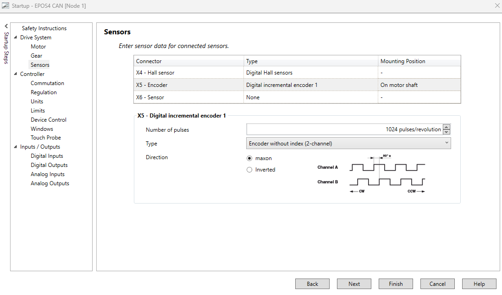
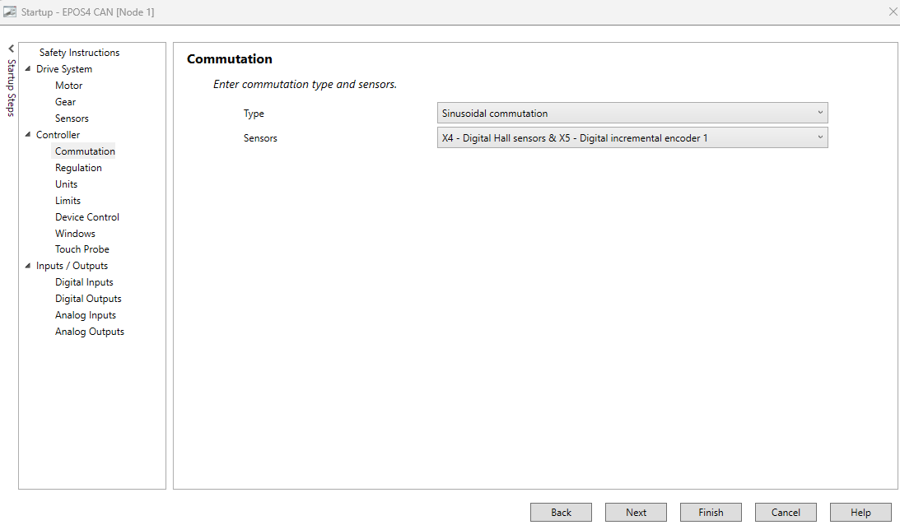
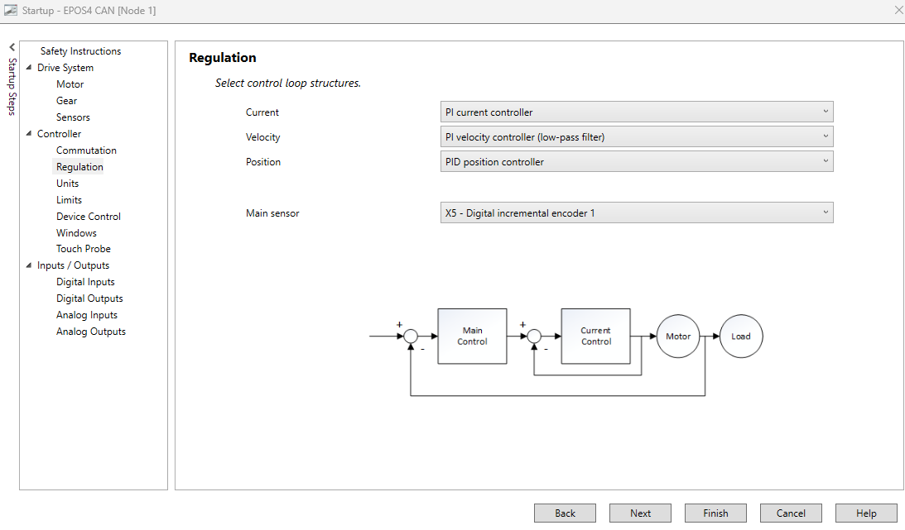
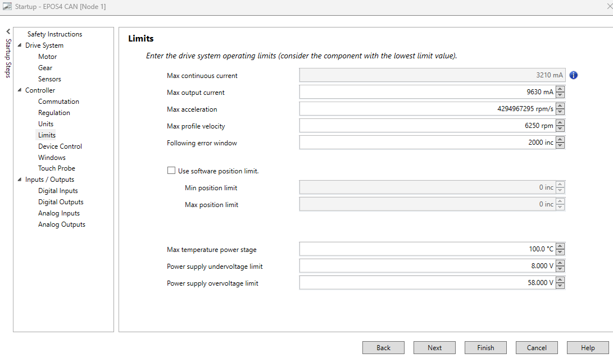
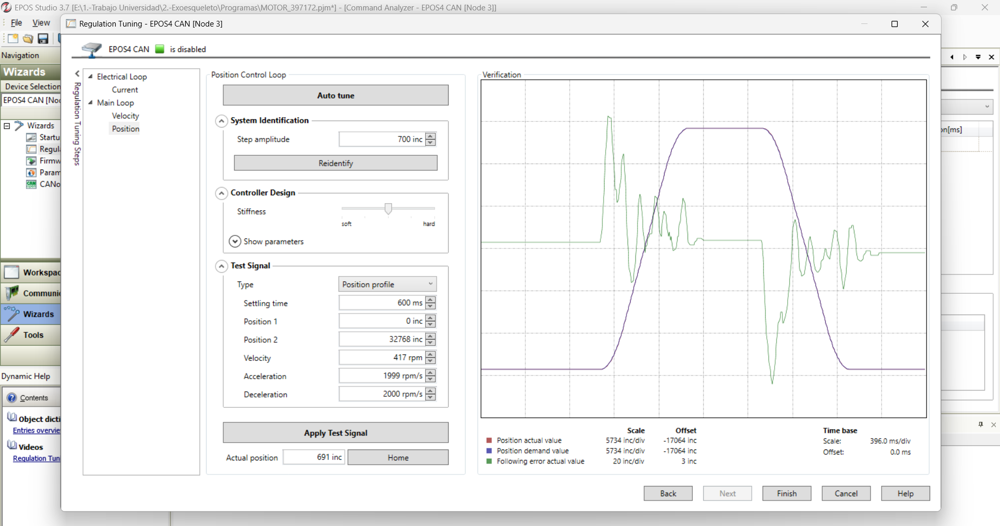

# 🔧 Configuración

## 🛠️ Conexión de Hardware

1. **Conectar el EPOS4 50/8** a la placa de conexión, debido a los pines es fácil indentificar la forma en la que debe colcarse.  

2. **Conectar el motor** que se desea configurar a la placa de conexión en el puerto **MOLEX 4** al conector correspondiente.  

3. **Conectar el encoder** (interno o externo) este permite conocer la ubicación del motor:
    - **Encoder interno** y **Encoder externo incremental** se conectan en puertos distintos, como se muestra en la siguiente figura.

4. **Conectar el cable de alimentación**: La placa de conexión cuenta con dos puertos de conexión.   
   - El EPOS4 cuenta con **dos puertos de alimentación**:  
     - **Entrada**: Desde la fuente de alimentación.  
     - **Salida**: Permite alimentar en serie otro EPOS4.  
   ⚠️ **Precaución**: Conectar mal estos puertos puede provocar un **cortocircuito**.  

  

5. **Fuente de 5V**: Necesaria para desbloquear el movimiento del sistema. *(Pendiente especificar el mecanismo exacto que se desbloquea)*.  

6. **Encendido y diagnóstico por LED**: Si está todo conectado correctamente relacionado con las fuentes de energía, ser podrá entonces visualizar el diodo led del EPOS4 de color: 

   - **Verde** ✅ → Funcionamiento correcto (generalmente después de la sintonización).  
   - **Rojo** ❌ → Error en configuración o incompatibilidad entre motor y parámetros del EPOS4.  

Esto se resolverá en la siguiente sección de configuración del controlador. 

7. **Conectar el EPOS4 al PC** mediante cable **Micro-USB**.  

## ⚙️ Configuración del Controlador

1. **Instalar EPOS Studio** en el PC.  

2. **Crear un nuevo proyecto** y seleccionar el modelo **EPOS4**.  

3. En el apartado **Communication**, hacer clic derecho y seleccionar **Connect**.  

  

4. Ir a **Wizards → Startup** para realizar el proceso de configuración, donde se definen las características del motor que controlará el EPOS4.  

  

### 🛠️ Proceso de Configuración del Motor
Para realizar el proceso de configuración del motor se requiere tener disponible el datasheet del respectivo motor. Los datasheet de los motores usados en esta aplicación  se encuentran en la carpeta [Docs](./Docs)

#### **1. Drive System / Motor**  

  

- **Nominal current** → Corriente nominal del motor.  
- **Thermal time constant winding**  
- **Max speed** → Según *datasheet*.  
- **Number of pole pairs**  

#### **2. Drive System / Sensors**  

  

- **Sensores Hall X4**: Sensores Hall.  
- **Encoder interno** (X5):  
  - Tipo: *Digital incremental encoder 1*.  

- **Encoder externo** (X6): Los que se encuentran en el laboratorio son AMT.  
  - Introducir el número de pulsos según el encoder AMT.  
  - Usar **AMT Viewpoint** para obtener la cantidad de pulsos de cada uno de los encoder. Para ello es necesario usar un conversor USB a UART. 
  - Dirección: **Inverted**.  

#### **3. Controller / Communication**  

  

- Seleccionar sensores a usar: solo Hall o Hall + Incremental (recomendado).  

#### **4. Controller / Regulation**  

  

- Seleccionar el tipo de control: **Corriente**, **Velocidad** o **Posición**.  

#### **5. Controller / Limits**  

  

- **Max output current** → Corriente nominal × 3  
- **Max acceleration** → Según requerimientos mecánicos.  
- **Max profile velocity** → Velocidad máxima según *datasheet* (limitada por número de polos).  
- **Following error window** → Según tolerancia de la aplicación.  

---

✅ **Finalizar** el asistente y guardar configuración.  

### 🛠️ Proceso de sintonización
#### **1. Sintonización en Wizard → Regulation Tuning**  

  

Existen tres formas de sintonizar el controlador: 

- **Electrical Loop → Current**: 
- **Main Loop → Velocity**     : 
- **Main Loop → Position**     : 

