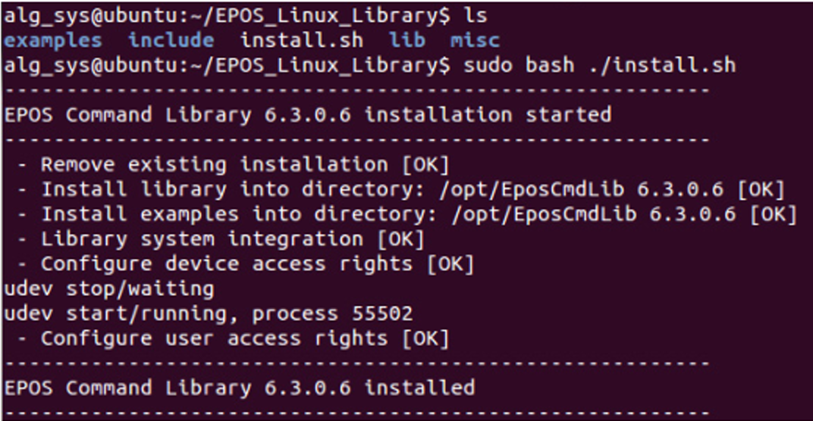

# 💻 Firmware del Exoesqueleto

En esta sección se presenta el firmware para manejar el exoesqueleto mediante **USB** y **CAN**, compatible con controladores **EPOS4** de Maxon.  

Instalar: 

- EPOS Studio
- AMT Viewpoint
- Visual Studio

---

## 🪟 Windows  
Control directo de un **único módulo EPOS4** a través de **USB**, usando **Visual Studio** y las librerías proporcionadas por Maxon.  

📂 **Ubicación de librerías:** [`Librería`](../Firmware/windows_programs/Libraries/)  

**Características:**
- Control individual de un EPOS4.
- Comunicación directa USB.
- Útil para pruebas de banco o calibración de un solo motor.

### 📦 Instalación de librerías en Visual Studio

1. Abrir Visual Studio.

2. Crear un nuevo proyecto tipo **Aplicación de consola en C++** y seleccionar la ubicación donde se almacenará el proyecto.

3. El código por defecto muestra un "Hello world", eliminar este contenido.

4. Configurar las librerías:

   - Copiar la carpeta `Definitions` en la carpeta del proyecto donde se encuentre el archivo `.cpp` actual.

   - Abrir el proyecto en Visual Studio.

   - Abrir el explorador de soluciones, dar clic derecho sobre el archivo `.cpp` del proyecto y seleccionar **Propiedades** → **Propiedades de configuración**.

   - En la opción **Directorios de VC++**:

     - En **Directorios de inclusión públicos** y **Directorios de archivos de bibliotecas**, agregar la ruta donde se encuentra la carpeta `Definitions`.

   - En la opción **Vinculador**:

     - En **General / Directorios de bibliotecas adicionales**, agregar la ruta de la carpeta `Definitions`.

     - En **Entrada / Dependencias adicionales**, agregar los archivos `EposCmd.lib` y `EposCmd64.lib`, separados por punto y coma (`;`).

   - Copiar los archivos `EposCmd.dll` y `EposCmd64.dll` en la carpeta `x64/Debug`.


### 📟[`Programas Windows`](../Firmware/windows_programs/)  

- **motor_maxon_test2.rar**

  Se conecta a un EPOS4 mediante interfaz USB. 

---

## 🐧 Ubuntu / Linux 
Mediante Linux actualmente se puede controlar los EPOS4 y sus motores mediante una red CAN, debido a que la librería proporcionada por Maxon para Linux es compatible. 

Control de los EPOS4 mediante **red CAN**, usando la librería oficial de Maxon para Linux.  

**Hardware compatible:**
- **PC con Ubuntu** + adaptador USB a CAN (ej. USB2CAN de Innomaker).
- **Raspberry Pi** + módulo MCP2515 (requiere adaptación de niveles de voltaje para SPI-CAN).


### 📦 Instalación de la librería en Linux
1. Descargar la librería oficial desde:  
   [EPOS4 50/8 - Página de producto Maxon](https://www.maxongroup.com/maxon/view/product/control/Positionierung/EPOS-4/504384)  
   En la sección **Descargas**, buscar el archivo **EPOS-Linux-Library**.

2. Descomprimir el archivo `.zip`.

3. Acceder a la carpeta **EPOS_Linux_Library**.

4. Ejecutar el script de instalación:
   ```bash
   sudo bash ./install.sh
    ```

   <p align="center">
     
   </p>


### 📟 [`Programas Linux`](../Firmware/linux_programs/)

En esta carpeta se encuentran varios programas desarrollados para el manejo de los motores mediante red CAN. Los principales archivos son:

- **listar_interfaces.cpp**  
  Detecta las interfaces CAN disponibles y muestra los nombres compatibles con la librería EPOS.

- **control_manual_CAN.cpp**  
  Permite conectarse y controlar un motor EPOS4 a través de la red CAN de forma manual.

- **menu_control_OneMotor.cpp**  
  Controla un solo EPOS4 mediante red CAN.  
  Funcionalidades principales:
  - Selección del nodo EPOS4 a controlar.
  - Menú para configurar la posición actual como posición cero.
  - Movimiento incremental del motor en ±5° para calibrar la posición cero.
  - Movimiento en un rango mayor de ±30°, considerando el engranaje, para pruebas y ajustes.
